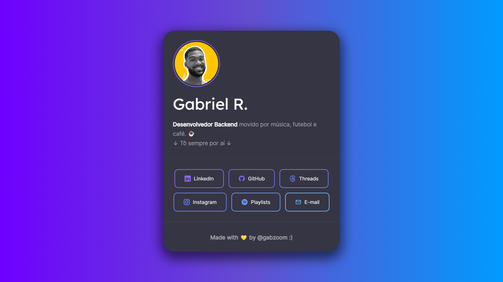

# Linktree card interativo
Esse projeto é uma página pessoal para exibir e divulgar links úteis sobre mim através de um card interativo.  
O projeto foi desenvolvido utilizando o conceito de Mobile First, que o torna responsivo para diferentes tamanhos de tela.  
Utilizei a biblioteca de JavaScript [vanilla-tilt.js](https://micku7zu.github.io/vanilla-tilt.js/) para aplicar o efeito de parallax no card ao interagir com o elemento HTML.

## 🚀 Tecnologias utilizadas
- ``HTML5``
- ``CSS3``
- ``JavaScript``
- ``vanilla-tilt.js``

## 💻 Demonstração
### <a href="https://gabzoom.vercel.app/" target="_blank">Clique aqui e acesse o projeto no ambiente de produção</a>

## 🛠️ Rodar o projeto localmente
Para rodar o projeto na sua máquina, clone o repositório em um diretório local e execute o arquivo ``index.html`` no seu navegador.

## 🧑🏾‍💻 Autor
Made with 💛 by [@gabzoom](https://www.github.com/gabzoom)
